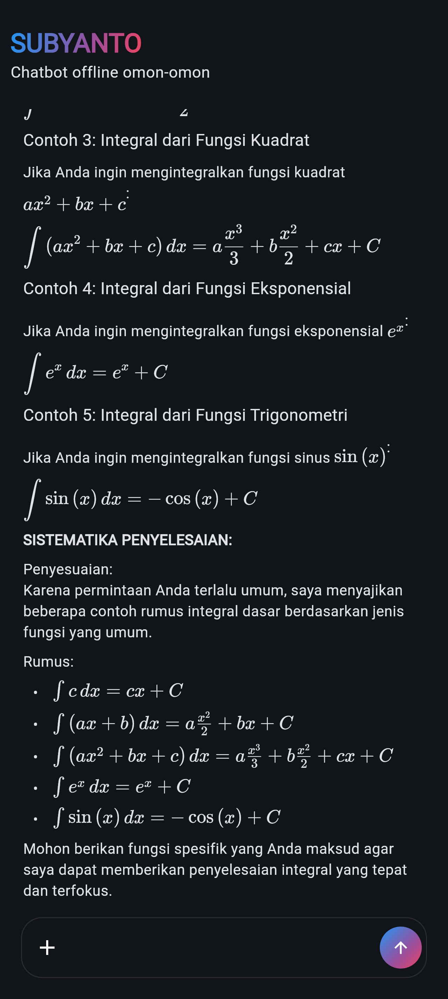
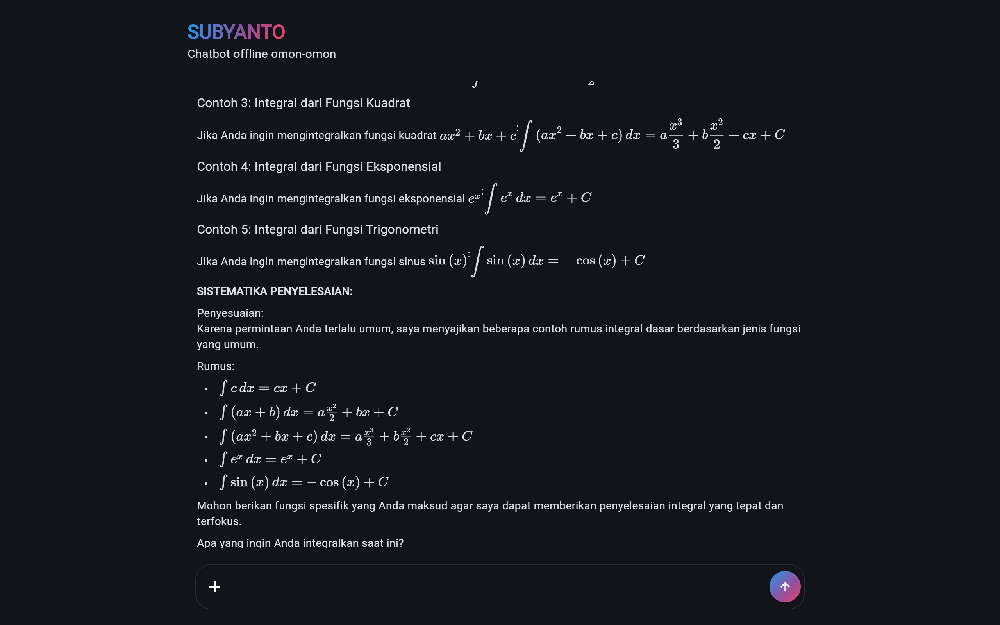

# **GEMMA-4-E2B-IT**

# 

[](https://www.python.org/downloads/)
[](https://flet.dev/)
[](https://pypi.org/project/litert-lm-api/)

## Deskripsi

Gemma-4-E2B adalah salah satu model AI llm yang dirancang khusus untuk bisa berjalan secara lokal pada perangkat seperti smartphone atau komputer tanpa koneksi internet. Diproject ini, saya membuat sebuah aplikasi chatbot yang di integrasikan dengan model gemma-4-E2B-it dengan nama AI-Assistent. AI-Assistent merupakan sebuah aplikasi yang dirancang untuk mempercantik tampilan supaya user lebih mudah dalam menggunakan model tersebut karena seperti yang tahu, model gemma-4-E2B membutuhkan infrastruktur perangkat lunak/mesin inference untuk dapat berjalan seperti (Ollama, LM Studio, dll). Untuk itu saya menggunakan library litert-lm-api sebagai infrastruktur untuk menjalan modelnya dikarenakan implementasinya lebih mudah diimplementasikan dibandingkan library seperti tensorflow.

## Demo Aplikasi

### Screenshot
| Mobile    | Type     |
| :-------- | :------- |
| </img> | </img> |

### Video
| Web View | Mobile View |
|:-------- | :---------- |
|  |  |

## Tech Stack

**User Interface**: Flet, Python

**Backend**: Flet-Camera, Litert-LM-API, Python


## Requirements

- [requirements.txt](requirements.txt)

## Instalasi

Aktifkan folder venv "gemma_4_E2B" terlebih dahulu:

**Linux**:
```bash
source bin/activate
```

**Windows**:
```cmd
nama_folder\Scripts\activate
```

Install requirements yang dibutuhkan dalam sebuah folder venv "gemma_4_E2B":

```bash
pip install -r requirements.txt
```

Jalankan flet via web atau via android:

**Web**:
```bash
flet run --web
```

**Android**:
```
flet run --android
```

Setelah berhasil di running, anda bisa meggunakan aplikasinya seperti cara anda melakukan prompting seperti AI pada umumnya.

## Social Media

- **Linkedin**: [M Galis Ansori](https://www.linkedin.com/in/m-galis-ansori-b9155636b?utm_source=share_via&utm_content=profile&utm_medium=member_android)

- **Instagram**: [m.galis_ansori](https://www.instagram.com/m.galis_ansori?stkn=MXBsNHZ4eDdxMmc3OA==)

## Support Me

- [Lynk.id](https://lynk.id/galis)